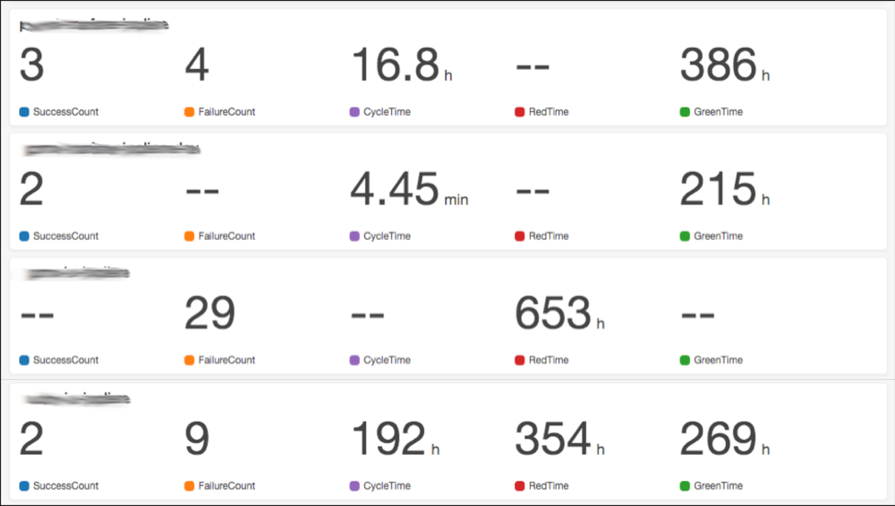

# Overview
This repo creates a CloudWatch dashboard for monitoring the health of pipelines in CodePipeline.



# Architecture
As seen in the diagram below, a Lambda function is triggered from a CloudWatch Event rule for CodePipeline events. The Lambda function then generates CloudWatch metrics. The CloudWatch dashboard is then build from the metrics that the Lambda function created.  The list of pipelines in the dashboard cannot be generated dyanmically so another Lambda function runs regulary to regenerate the dashboard based on whatever metrics have been created. 


# Prerequisites
You must have an S3 bucket available for staging the Lambda function.   You can create one with (bucket-name with prefix s3://):

```
aws s3 mb <bucket-name>
```

# Deploying
To deploy in your own account, run (bucket-name without prefix s3://):

```
make deploy BUCKET_NAME=<bucket-name>
```

# Removing
To remove from your account, run:

```
make undeploy
```
